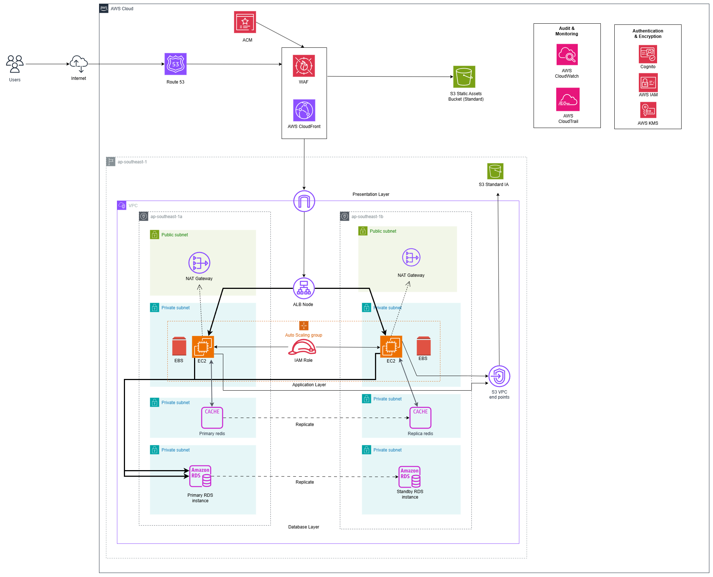
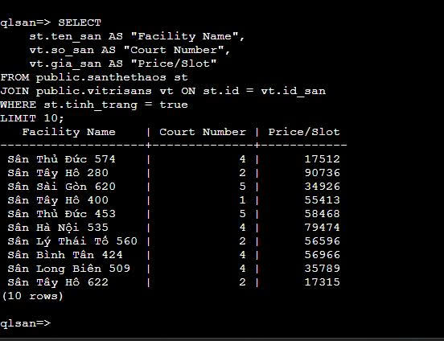
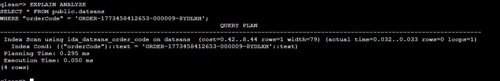
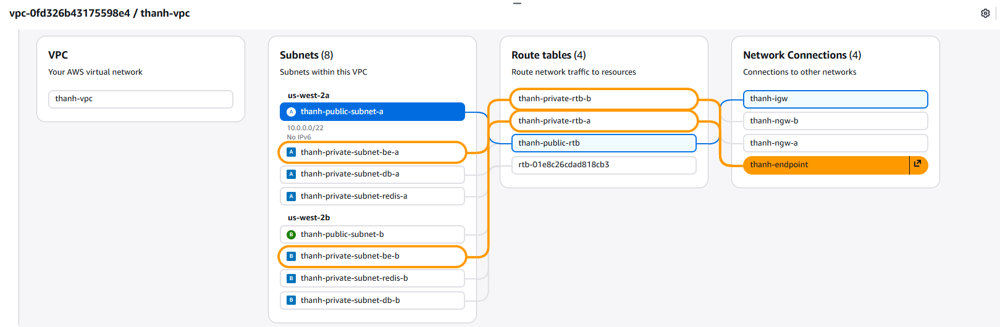

# Evidence Pack - Week 3: Deployment & Evidence

**Group:** 7
**Members:** Bùi Thành Nghĩa, Lê Thị Thùy Trang, Trần Minh Quang, Hoàng Kim Hùng, Nguyễn Công Thịnh, Phạm Công Huy, Nguyễn Tất Văn, Lê Nguyễn Nhật Thành, Đỗ Phúc
**Project:** Sports Field Booking System (AWS 3-Tier Architecture)

---

## 1. Project Foundation
* **Chosen Database Engine & Paradigm:** Amazon RDS PostgreSQL / Relational
* **W2 Evidence Link:** 

---

## 2. Data Access Pattern Log

---

## Part A — Three Core Data Access Patterns

### Pattern 1 — Booking Creation & Payment Processing
Create multiple `datsans` records (one per timeslot), generate PayOS payment link, then atomically update `tinh_trang = true` on successful payment confirmation  
→ **~100–150 calls/min during peak hours (6 PM–9 PM, weekends)**

---

### Pattern 2 — User Booking History Timeline
SELECT `datsans` joined with `vitrisans`, `santhethaos`, `danhgias`, filtered by `id_nguoi_dung`, ordered by `ngay_dat DESC` with facility name and rating  
→ **~20–30 calls/min (steady; triggered when user opens booking history page)**

---

### Pattern 3 — Revenue & Facility Analytics (Aggregation)
GROUP BY facility (`santhethaos.ten_san`) and `SUM(thanh_tien)` or `COUNT(datsans.id)` where `id_chu_san = :owner_id`, spanning joins:  
`datsans → vitrisans → santhethaos`  
→ **~5–10 calls/day (business intelligence dashboard, daily report generation)**

---

## Part B — Paradigm Analysis & Index Strategy

### Pattern 1 — Relational + B-tree Composite Index

**Paradigm Effectiveness**  
PostgreSQL's relational model enforces referential integrity across  
(`datsans → vitrisans → santhethaos`) via foreign keys, ensuring bookings cannot reference non-existent facilities.

Transactions guarantee all-or-nothing atomicity:  
multiple `INSERT datsans` + `UPDATE tinh_trang` complete together or both fail (no partial bookings).

**Index**
- Composite B-tree on `(orderCode, tinh_trang)`  
  → locates pending payment records in **O(log n)** without table scan  
- Simple B-tree on `(id_nguoi_dung)`  
  → retrieves user's bookings by ROWID lookup

**Self-Hosted EC2 Trade-off**
- Eliminates **$200–500/month AWS RDS baseline cost + per-GB backup charges**
- Sacrifice automated failover:
  - **RPO ~1 hour** via `pg_basebackup` to secondary EC2 + streaming replication  
  - **RTO ~5 min** manual promotion  

**Chosen Strategy**
- Budget optimization
- Production recommendation:
  - Cross-AZ EBS snapshots hourly
  - Automated failover (Patroni or repmgr)

**Estimated Cost**
- ~$50/month compute vs. ~$300/month RDS redundancy

---

### Pattern 2 — Relational + Clustered Foreign-Key Indexes

**Paradigm Effectiveness**  
Multi-table JOINs (5 tables) are native to relational design.

Filter push-down on:
- `(id_nguoi_dung, tinh_trang = true)`

→ reduces intermediate result sets:
- From all bookings → single user's 10–20 bookings before joining

Non-relational (document) stores lack built-in foreign-key enforcement, requiring application-layer validation.

**Index**
- B-tree on `datsans(id_nguoi_dung)`  
- B-tree on `danhgias(id_vi_tri_san)`  
  → enables nested-loop join with early termination  

- B-tree on `vitrisans(id_san)`  
  → enables single-hop lookup to `santhethaos`

**Self-Hosted Strategy**
- WAL archival to S3 (`pg_basebackup + s3:// URI on secondary`)

**Recovery Metrics**
- **RTO:** 30 min (restore from snapshot + replay WAL)  
- **RPO:** ~15 min  

**Cost**
- 1 large EC2 (m5.xlarge ~$150/mo)
- micro standby ($30/mo)

→ vs. RDS Multi-AZ ($450/mo)

**Trade-off**
- Lose real-time HA  
- Gain control over upgrade windows

---

### Pattern 3 — Relational + Aggregate-Aware Index

**Paradigm Effectiveness**  
GROUP BY + SUM/COUNT aggregations are relational specialties.

PostgreSQL planner uses:
- **Index-Only Scans (IOS)** when `(id_chu_san, thanh_tien)` are indexed  
→ avoids heap lookups entirely (reads only index pages)

Document stores (MongoDB):
- Must scan full documents for aggregation  
→ ~3–5× slower without pre-computed counters

**Index**
- Composite B-tree `(id_chu_san, thanh_tien)` → enables IOS  
- Partial index on `tinh_trang = true`  
  → excludes cancelled orders from scan (avoid dead tuples in MVCC)

**Self-Hosted Rationale**
- Analytics jobs:
  - 10–30 sec scans of 10M rows  
  - batch-scheduled nightly  
  - no real-time failover SLA  

**Backup Strategy**
- Single EC2
- Hourly EBS snapshots
- Weekly full backups to S3 Glacier

**Cost**
- Storage: ~$5/mo  
- Restore: ~$1 per restore  

**Recovery**
- **RTO ~2 hours** acceptable

**Conclusion**
- RDS would cost ~$300/mo for identical performance

---

## Part C — Wrong-Paradigm Test (Pattern 1: Booking Creation)

**Why Key-Value Store (Redis/Memcached) Fails**

A pure Key-Value store (e.g., Redis, Memcached) cannot atomically enforce the constraint:

- `"orderCode must be globally unique"`
- `"tinh_trang must only transition false → true"`

Redis transactions (`WATCH/MULTI/EXEC`):
- Lack isolation levels  
- Cannot serialize:
  1. INSERT datsans #1  
  2. INSERT datsans #2  
  3. UPDATE `tinh_trang = true`

**Failure Scenario**
- Two concurrent requests generate same `orderCode`
- No foreign-key or UNIQUE constraint → data corruption

**Workaround (but costly)**
- Distributed locking (Redlock):
  - Requires 3-node setup (~$150/mo)
  - Adds **5–30ms latency per booking**
  - At 100 req/min → 100+ lock ops/min → contention risk

**Relational Advantage**
- PostgreSQL:
  - UNIQUE constraint  
  - ACID transactions  
  - SERIALIZABLE isolation  

→ Detects conflict **atomically in microseconds**

---

---

## 3. Deployment Evidence

### AC #1: Database Instance Setup & Network Isolation
* **Evidence:** 
    
    
* **Technical Notes:** The RDS instance is deployed within a Private Subnet group. We explicitly disabled "Public Access." This architectural decision ensures the database is completely isolated from the public internet, mitigating direct external attack vectors. Only the Application Tier (EC2 instances) can route traffic to it.

### AC #2: Data Encryption at Rest
* **Evidence:** 
    
* **Technical Notes:** Storage encryption at rest is enforced using the AWS-managed KMS key (`aws/rds`). We chose the managed key approach over a Customer Managed Key (CMK) to minimize operational overhead regarding key rotation while still satisfying strict data protection compliance for user PII and payment records.

---
## 4. Working Query Evidence

### Query 1: Relational JOIN (Browse Facility Details)
* **Description:** Retrieves consolidated facility information by joining santhethaos and vitrisans. This allows users to view comprehensive details including facility names, court numbers, and pricing in a single view
* **Evidence:**
    > 
* **Operation:**
    ```sql
    SELECT 
      st.ten_san AS "Facility Name", 
      vt.so_san AS "Court Number", 
      vt.gia_san AS "Price/Slot"
    FROM public.santhethaos st
    JOIN public.vitrisans vt ON st.id = vt.id_san
    WHERE st.tinh_trang = true
    LIMIT 10;
    ```

### Query 2: Indexed Lookup (Verify Payment Order)
* **Description:** Performs a high-speed lookup of a specific booking record using the orderCode. This operation is critical for real-time payment confirmation via PayOS Webhooks.
* **Evidence:**
    > 
* **Operation:**
    ```sql
    EXPLAIN ANALYZE
    SELECT * FROM public.datsans 
    WHERE "orderCode" = 'ORDER-1773458412653-000009-8YDLXH';
    ```

---

## 5. Lambda + Bedrock Evidence


---

## 6. VPC & Networking Evidence

### AC #1: S3 Gateway Endpoint
* **Evidence:** 
    
    
* **Technical Notes:** Implementing a Gateway Endpoint ensures that traffic between our private EC2 instances and S3 never traverses the public internet, significantly enhancing security and eliminating NAT Gateway data processing charges for internal traffic.

### AC #2: Database Security Group Rules
* **Evidence:** 
    
    
* **Technical Notes:** The inbound rule explicitly references the Security Group ID of the Application Tier (`sg-0abcd1234...`) on port 5432, rather than a CIDR block. This creates a logical security boundary: even if a new EC2 instance is launched in the private subnet, it cannot access the database unless it is explicitly attached to the Application Security Group.


